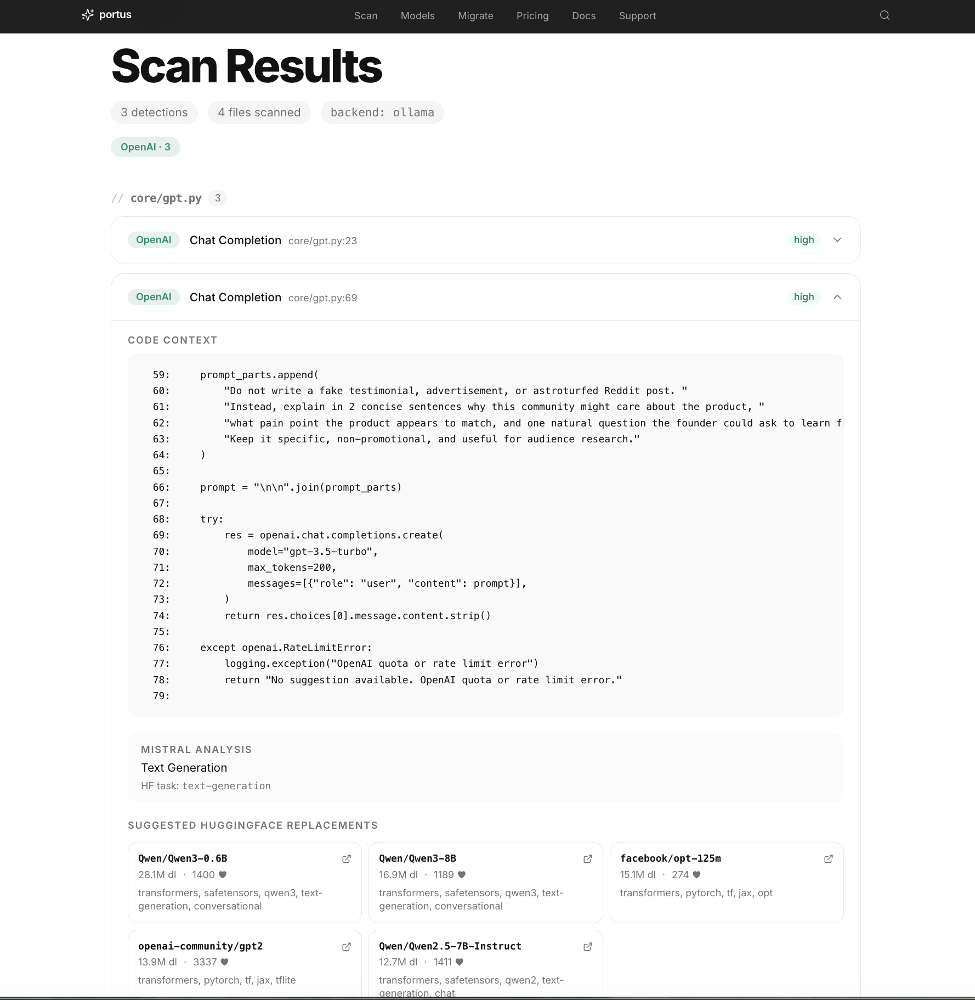
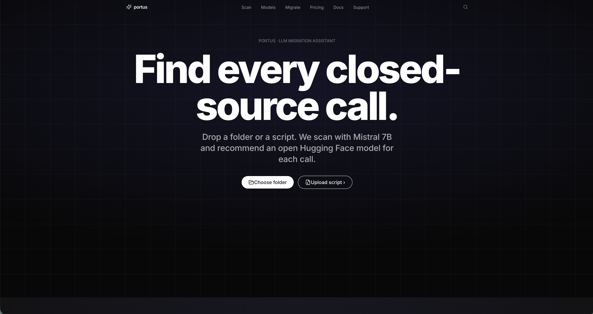

# Portus

A full-stack LLM migration assistant that scans Python, JavaScript, and TypeScript codebases for commercial AI API usage and suggests open-source Hugging Face model replacements.

## Problem

Teams often depend on paid or closed AI APIs without a clear view of where those dependencies exist in their codebase or what open-source alternatives might be viable.

## Solution

Hugging Face Search scans uploaded codebases for commercial AI API calls, extracts relevant context, classifies the likely ML task, and ranks open-source Hugging Face model alternatives.

## Architecture

```text
upload
  → static scanner
  → context extraction
  → Mistral task classification
  → Hugging Face model ranking
  → frontend report
```

## Features

* Detects AI API usage in Python, JavaScript, and TypeScript files
* Identifies providers such as OpenAI, Anthropic, and Gemini
* Extracts nearby code context around each detection
* Uses Mistral-based task classification when available
* Ranks Hugging Face alternatives by task match, downloads, and likes
* Serves results through a FastAPI backend and React/TypeScript frontend

## Demo

### Scan results



### Landing page



## Example scan result

```json
{
  "total_detections": 1,
  "files_scanned": 3,
  "backend_used": "mistral",
  "detections": [
    {
      "file": "app/chat.py",
      "line_number": 12,
      "provider": "openai",
      "method": "chat.completions.create",
      "detection_type": "sdk_import",
      "analysis": {
        "task_description": "chat completion / conversational text generation",
        "hf_pipeline_tag": "text-generation",
        "confidence": 0.87
      },
      "suggestions": [
        {
          "id": "mistralai/Mistral-7B-Instruct-v0.3",
          "task": "text-generation",
          "downloads": 1234567,
          "likes": 1000,
          "source": "huggingface"
        }
      ]
    }
  ]
}
```

## Quick start

Run the backend:

```bash
cd backend
python -m venv .venv
source .venv/bin/activate
pip install -r requirements.txt
cd ..
uvicorn backend.server:app --reload --port 8000
```

In a separate terminal, run the frontend:

```bash
cd frontend
npm install
npm run dev
```

The frontend should be available through the configured Vite dev URL:

```text
http://localhost:8080
```

The backend should be available at:

```text
http://localhost:8000
```

Health check:

```bash
curl http://localhost:8000/api/health
```

## Environment

The app can run in detection-only mode without external credentials. Optional environment variables can be added through a local `.env` file.

```text
HF_TOKEN=
PORT=8000
```

## Tests

Run backend tests from the repository root:

```bash
pytest backend/tests -q
```

Run frontend build checks:

```bash
cd frontend
npm run build
```

## Limitations

* Static detection can miss wrapper functions, indirect imports, dynamically generated calls, or API usage hidden behind internal SDKs.
* Model recommendations depend on the quality and freshness of Hugging Face metadata.
* Suggested models are starting points, not guaranteed drop-in replacements.
* This tool is not legal, compliance, privacy, or security advice.

## Tech stack

* Python
* FastAPI
* Mistral
* Hugging Face Hub
* React
* TypeScript
* Vite
